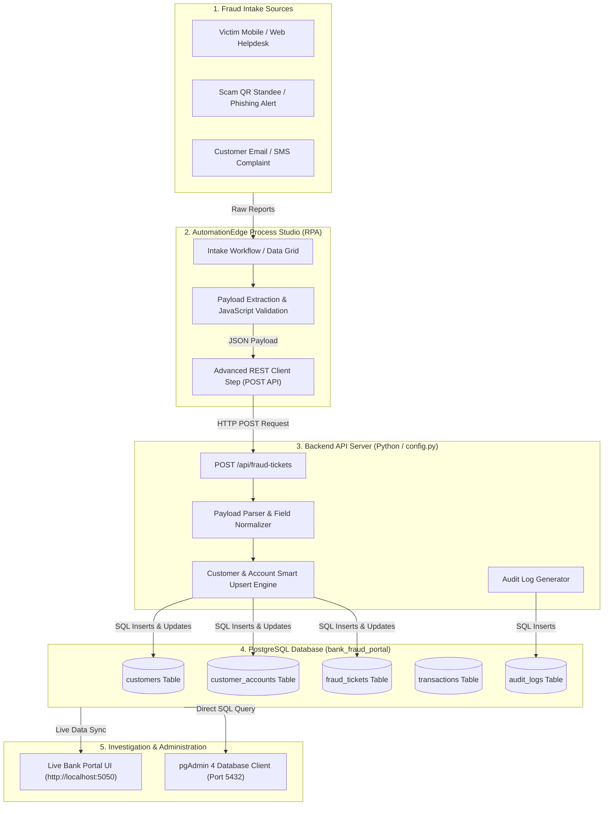

# Phase 1: Automated Bank Fraud Intake & Investigation Portal

**Project Title**: Dummy Bank Portal — Fraud Case Management & RPA Intake System  
**Phase**: Phase 1 Delivery Documentation  
**Version**: 1.0  
**Target Audience**: Engineering Leadership, Product Management, Bank Operations  

---

## 1. Executive Summary

In **Phase 1**, we designed, developed, and deployed an end-to-end **Automated Fraud Complaint Intake & Case Management System**. The system bridges automated Robotic Process Automation (**AutomationEdge Process Studio**) with a **PostgreSQL Database** and a **Web-Based Banking Portal**.

### Key Objectives Achieved in Phase 1:
- **Automated Incident Ingestion**: Built a REST API gateway allowing Process Studio RPA workflows to submit real-time fraud incidents from diverse intake channels (e.g., QR Code scams, UPI fraud, phishing, fake loan applications).
- **Single Source of Truth Database**: Designed a normalized PostgreSQL database (`bank_fraud_portal`) with complete customer profiles, bank accounts, fraud incident records, financial transaction histories, and immutable audit logs.
- **Clean Operations Dashboard**: Created a Corporate White & Deep Blue UI supporting live search, status filtering, one-click account freezing, detailed case investigation modals, and audit tracking.
- **pgAdmin 4 Visibility**: Enhanced all core database tables and views with direct customer name mappings for instant readability by database administrators and investigators.
- **Secure Parameterization**: Decoupled all database and server credentials into a centralized `.env` configuration.

---

## 2. System Architecture & End-to-End Flow

The following diagram illustrates the Phase 1 architecture and real-time data lifecycle:



---

## 3. Process Studio to Portal Data Flow (Step-by-Step)

```
[ Step 1: Ingestion ]
  Process Studio extracts fraud report fields (Customer Name, Phone, Email, Account No, Amount, Incident Type, Severity).

[ Step 2: Payload Formatting ]
  A 'Modified Java Script Value' step formats the record into a clean JSON string using JSON.stringify().

[ Step 3: REST Dispatch ]
  The 'Advanced REST Client' step sends an HTTP POST request to:
  http://127.0.0.1:5050/api/fraud-tickets

[ Step 4: Backend Upsert & Audit Logging ]
  The backend server:
  1. Checks if the customer exists by email/phone/name (reuses profile if found, otherwise creates new).
  2. Verifies customer account record.
  3. Inserts a new fraud ticket with unique ticket number (e.g., FRD-2026-XXXXXX).
  4. Generates an automated audit log entry.
  5. Commits the transaction to PostgreSQL.

[ Step 5: Real-Time UI & Database Update ]
  The incident immediately appears on the Web Dashboard and in pgAdmin 4 for fraud analysts to investigate and take action.
```

---

## 4. Core Components Delivered in Phase 1

### 1. Web Application Frontend (`index.html`, `styles.css`, `app.js`)
- **Theme & Aesthetics**: Corporate White & Deep Blue banking interface with standard Indian Rupee (`₹`) currency formatting and Indian customer profiles.
- **Top Metric Cards**: Real-time summary of Total Fraud Cases, Total Amount Involved, Amount Successfully Recovered, Active Investigations, and Frozen Accounts.
- **Search & Filter Bar**: Instant client-side search by Customer Name, Account Number, or Ticket ID with status filters (*All*, *Under Investigation*, *Frozen*, *Resolved*).
- **Interactive Investigation Modal**: Clicking *"View Details"* displays full customer KYC info, account balance, fraud summary, suspect entity, linked recent transactions, and complete audit history.
- **Action Buttons**: Fraud analysts can toggle account freezes (*"Freeze Account"*) or mark cases as resolved with automated audit trail generation.

### 2. Backend Server & REST API Gateway (`server.py`, `config.py`)
- **Environment Driven**: Connects using parameters from `.env` via `config.py` (zero hardcoded passwords).
- **Flexible Field Extraction**: Handles any casing or naming variations (`full_name`, `customer_name`, `account_number`, `amount_involved`, etc.).
- **Smart Customer Upsert**: Reuses existing customer IDs if the customer already has an account, avoiding duplicate key constraint violations.
- **REST API Endpoints**:
  | Endpoint | Method | Purpose |
  | :--- | :---: | :--- |
  | `/api/overview` | `GET` | Dashboard KPI metrics and aggregations |
  | `/api/fraud-tickets` | `GET` | List all fraud tickets with customer and account details |
  | `/api/fraud-tickets` | `POST` | Automated endpoint for Process Studio RPA ingestion |
  | `/api/fraud-tickets/{id}` | `GET` | Full case breakdown including transactions and audit logs |
  | `/api/fraud-tickets/{id}` | `PATCH`| Update case status (`FROZEN`, `RESOLVED`, `UNDER_INVESTIGATION`) |
  | `/api/freeze-account` | `POST` | Emergency account freeze trigger |
  | `/api/customers` | `GET` | All customer profiles and risk tier ratings |
  | `/api/transactions` | `GET` | Global transaction log with fraud flag indicators |

### 3. PostgreSQL Database & Schema (`schema.sql`, `db_setup.py`)
- **Database**: `bank_fraud_portal`
- **Tables**:
  1. `customers`: Customer master with name, code, contact, address, KYC status, and risk tier.
  2. `customer_accounts`: Account numbers, balance in ₹, account type, status, branch.
  3. `fraud_tickets`: Fraud incidents, amounts involved, suspect merchant, investigator, status.
  4. `transactions`: Transaction ledger with fraud risk scoring (0-100) and flagging.
  5. `audit_logs`: Timestamped log of every SOC action, automated intake, and status change.
- **Views**:
  - `v_fraud_tickets_full`: Flattened view combining ticket, customer, and account details.
  - `v_customer_fraud_summary`: Customer-level aggregate of fraud incidents and amounts.

---

## 5. Configuration & Security Management

All environment variables and database credentials are managed strictly through `d:\CUSTOMER\.env`:

```ini
# Application Server Configuration
PORTAL_HOST=127.0.0.1
PORTAL_PORT=5050

# PostgreSQL Database Configuration
DB_HOST=127.0.0.1
DB_PORT=5432
DB_USER=postgres
DB_PASS=<YOUR_DB_PASSWORD>
DB_NAME=bank_fraud_portal

# pgAdmin 4 Access
PGADMIN_HOST=127.0.0.1
PGADMIN_PORT=5050
PGADMIN_USER=postgres
PGADMIN_PASSWORD=<YOUR_PGADMIN_PASSWORD>
```

---

## 6. Process Studio RPA Workflow Configuration

To trigger automated fraud reporting from Process Studio:

### Step 1: Modified JavaScript Value Step
```javascript
var request_body = JSON.stringify({
    "full_name": full_name,
    "email": email,
    "phone": String(phone),
    "account_number": String(account_number),
    "account_type": account_type,
    "incident_type": incident_type,
    "amount_involved": Number(amount_involved),
    "severity": severity,
    "suspect_entity": suspect_entity,
    "description": description
});
```

### Step 2: Advanced REST Client Step
- **URL**: `http://127.0.0.1:5050/api/fraud-tickets`
- **Method**: `POST`
- **Request Body Field**: `request_body`
- **Header**: `Content-Type: application/json`
- **Expected Response**: `201 Created` with `{"success": true, "ticket_id": ..., "ticket_number": "FRD-2026-..."}`

---

## 7. Phase 1 Verification & Quality Assurance

| Test Scenario | Input / Action | Result | Status |
| :--- | :--- | :--- | :---: |
| **API Ingestion** | Process Studio sends Fake QR Code Scam for `Abhishek` (₹15,000) | `201 Created` returned; ticket `FRD-2026-0046` created | PASS |
| **Duplicate Customer Handling** | Process Studio re-sends complaint with existing email `abhi@gmail.com` | Reuses customer ID; creates linked ticket `FRD-2026-005509` | PASS |
| **Database Persistence** | SQL Query in pgAdmin 4: `SELECT * FROM fraud_tickets` | Row visible immediately with customer name, amount, and account | PASS |
| **UI Real-Time Sync** | Refresh Bank Portal UI | New tickets appear at top; KPI counters increment dynamically | PASS |
| **Account Freeze** | Click "Freeze Account" on UI | Sets account and ticket status to `FROZEN`; creates audit log | PASS |
